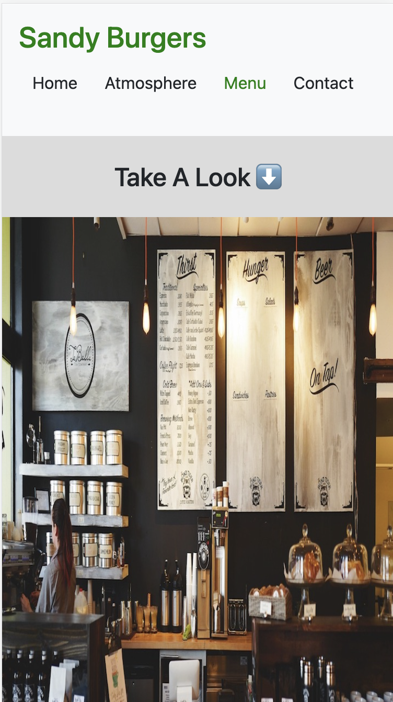

# restaurant_page

## This is a simple restaurant website for me as a training working with webpack.

## Built With 

- Vanilla JS
- HTML5
- CSS3
- Bootstrap

## Live Demo

[Restaurant Page:]https://sandywezzy.github.io/restaurant_page/

## Getting Started

In order to setup and work on this project on your own, you will need to:

1. Clone this project:  
`git clone git@github.com:SandyWezzy/restaurant_page.git`

2. Once you have cloned this project, you can install the required dependencies by using:  
`npm install`

3. A live demo of the project can be started by using:  
`npm start`

4. Distribution files can be produced using:  
`npm run build`

### Usage

##### Once you are on the Home Page, you have three links in the navbar
- **Home**.- To return to the Home Page
- **Menu**.- A small fraction of the Dishes and Drinks that we serve
- **Atmoshpere**.- Some nice pictures of the restaurant

## 🤝 Contributing

Contributions, issues, and feature requests are welcome!

## Show your support

If you got until here, show your love hitting the ⭐️ button, I'd really appreciate it.
